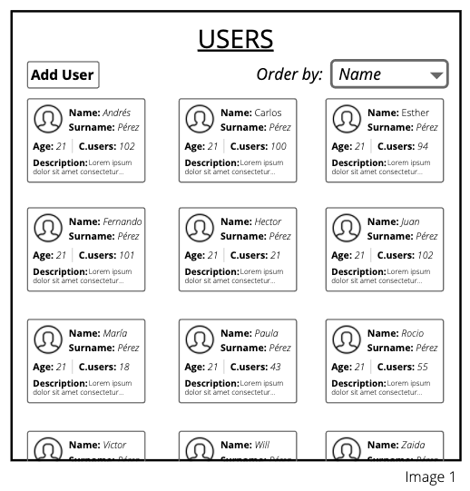
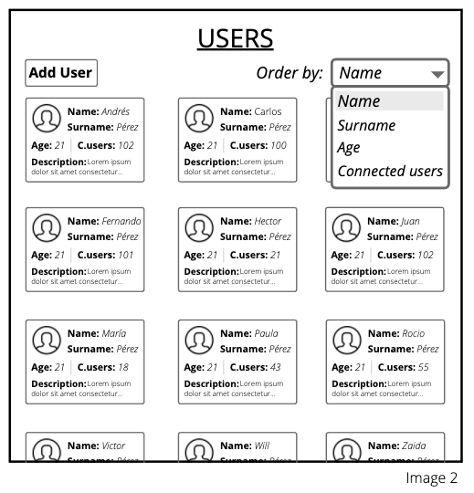
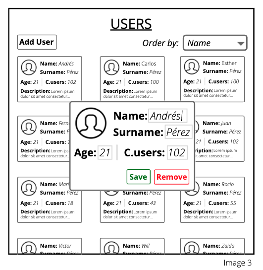

# BotXO test &middot; 

This test is an assignment focused on understanding your decision process and skills
towards front end web applications. Below you are presented with a design
wireframe (_Image 1_) and the following implementation must be based on it.

Attached to this assignment file, you will also find a JSON data source file
(_“users.json”_) which must be used for the content of the cards displayed in the
screen.

These are the different aspects (prioritized) we will evaluate about the code
delivered:

**Clean code > Component Architecture > Style guides > Design**

Test code is divided in 3 different exercises, each one requires a different
functionality.

#### Exercise 1:

Render the different cards as you can see in the Image 1, and cards must be loaded as lazy load of 15 in 15.

#### Exercise 2:

It must be possible to sort the user cards (from high to low) by "name", "surname", "age" and "connected users". (Image 2 below)

#### Exercise 3:

If user clicks in a card, this card will open a new modal where the user will be able to edit the different fields or remove the user (See Image 3 below).

If end user clicks in "Add user" button, then the modal will be open with empty fields.

In both cases when the end user click in "save" the card will be modified and the list of users will be ordered with this modification as it was, in case that the end user clicks in remove then the card will disappear of the users list and the list will keep ordered as it was.

#### Appendix I – Requirements

**ReactJS + Redux** (data and states may be handled with Redux or Context API, open option)

1. Data must be handled using **Immutable** library
2. App must be compiled using **webpack**
3. Test must be implemented with **Jest**

OPTIONAL: Feel free to use **functional programming** to solve any of the challenges presented. It will be positively received. The use of typescript in the Component definition is also a positive option.

You have up to **24 hours** to complete this challenge.

Fast delivery time will also be positively valued.

Documentation:

A README.md file will be required in which the high-level architecture, the functionalities and components of the solution are explained. Also, the steps explaining how to fire up the solution locally and execute the tests.

#### Appendix II – Remarks

- The UI implemented must be based on the wireframes provided but it does not have to use the same typography, inputs, icons, etc.
- The app must be designed with the right levels of abstraction building components and reusing them.
- Any change or addition to the suggested UI will always be welcome as long as it is properly explained why it was added. For example: “use of a certain library for better performance”.

## Installation

- Install dependencies with your favourite package manager with `npm install` or `yarn`.

## Available Scripts

In the project directory, you can run:

### `yarn start`

Runs the app in the development mode. 
Open [http://localhost:3000](http://localhost:3000) to view it in the browser.

The page will reload if you make edits. 
You will also see any lint errors in the console.

### `yarn test`

Launches the test runner in the interactive watch mode. 
See the section about [running tests](https://facebook.github.io/create-react-app/docs/running-tests) for more information.

### `yarn build`

Builds the app for production to the `build` folder. 
It correctly bundles React in production mode and optimizes the build for the best performance.

The build is minified and the filenames include the hashes. 
Your app is ready to be deployed!

See the section about [deployment](https://facebook.github.io/create-react-app/docs/deployment) for more information.

### `yarn eject`

**Note: this is a one-way operation. Once you `eject`, you can’t go back!**

If you aren’t satisfied with the build tool and configuration choices, you can `eject` at any time. This command will remove the single build dependency from your project.

Instead, it will copy all the configuration files and the transitive dependencies (webpack, Babel, ESLint, etc) right into your project so you have full control over them. All of the commands except `eject` will still work, but they will point to the copied scripts so you can tweak them. At this point you’re on your own.

You don’t have to ever use `eject`. The curated feature set is suitable for small and middle deployments, and you shouldn’t feel obligated to use this feature. However we understand that this tool wouldn’t be useful if you couldn’t customize it when you are ready for it.

### `yarn storybook`

Runs the storybook in the development mode. 
Open [http://localhost:9009](http://localhost:9009) to view it in the browser.

The page will reload if you make edits. 
You will also see any lint errors in the console.

### `yarn build-storybook`

Builds the storybook for production to the `build` folder. 
It correctly bundles Storybook in production mode and optimizes the build for the best performance.

The build is minified and the filenames include the hashes. 
Your storybook is ready to be deployed!

See the section about [deployment](https://facebook.github.io/create-react-app/docs/deployment) for more information.

### License

Mustodon is [MIT licensed](./LICENSE).
